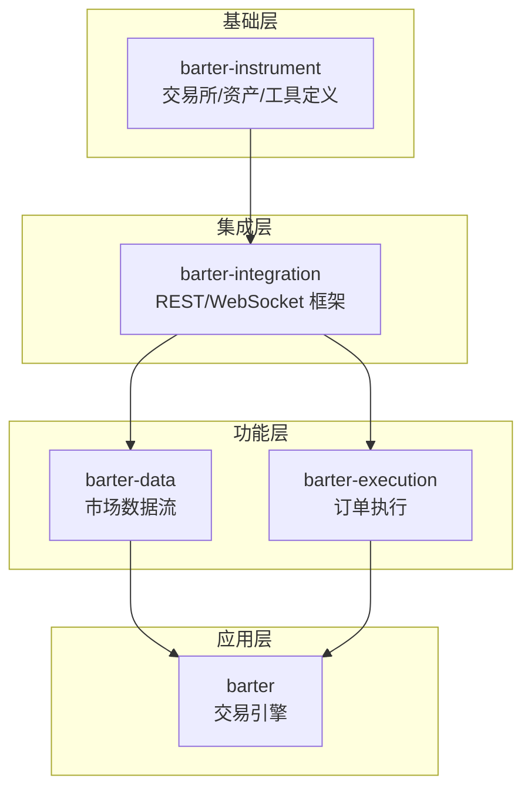
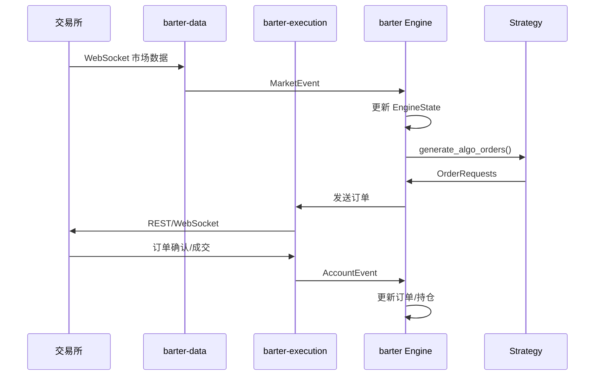
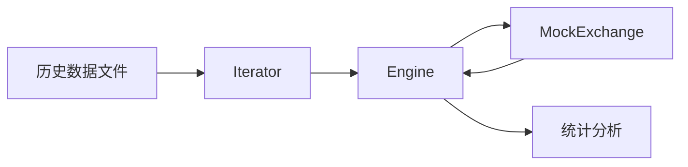

# Barter-RS 整体架构分析

## 项目概述

Barter-RS 是一个用于构建高性能实盘交易、模拟交易和回测系统的 Rust 算法交易生态系统。采用模块化设计，各组件职责分明，可独立使用或组合使用。

## 总体特性

- **高速**：原生 Rust，最小化内存分配，O(1) 状态查找
- **稳健**：强类型，线程安全，广泛测试覆盖
- **可定制**：即插即用的 Strategy/RiskManager 组件
- **可扩展**：支持多交易所、多策略并行

---

## 模块依赖关系



---

## 各模块概要

| 模块 | 职责 | 核心类型 |
|------|------|----------|
| **barter-instrument** | 基础数据结构 | `ExchangeId`, `Asset`, `Instrument`, `IndexedInstruments` |
| **barter-integration** | 网络通信框架 | `RestClient`, `ExchangeStream`, `Transformer` |
| **barter-data** | 市场数据采集 | `MarketStream`, `Connector`, `Subscription`, `Streams` |
| **barter-execution** | 订单执行管理 | `ExecutionClient`, `Order`, `AccountEvent` |
| **barter** | 交易引擎核心 | `Engine`, `EngineState`, `Strategy`, `RiskManager` |

---

## 核心数据流

### 实盘交易流程



### 回测流程



**关键区别**：
- 实盘：使用 `LiveClock` + 真实 `ExecutionClient`
- 回测：使用 `HistoricalClock` + `MockExchange`

---

## 索引系统设计

所有模块共享统一的索引系统，实现 O(1) 查找：

```
ExchangeId  →  ExchangeIndex  →  Vec<Exchange>
Asset       →  AssetIndex     →  Vec<Asset>
Instrument  →  InstrumentIndex→  Vec<Instrument>
```

**设计原因**：
1. 避免字符串比较和哈希计算
2. 缓存友好的连续内存布局
3. 编译期类型安全，防止索引混淆

---

## 可扩展性设计

### 添加新交易所

1. **barter-data**: 实现 `Connector` trait
2. **barter-execution**: 实现 `ExecutionClient` trait
3. **barter-instrument**: 添加 `ExchangeId` 枚举值

### 添加新策略

```rust
struct MyStrategy;

impl AlgoStrategy for MyStrategy {
    fn generate_algo_orders(&self, state: &State) -> (Cancels, Opens) {
        // 您的策略逻辑
    }
}
```

### 添加新数据类型

1. 定义 `SubscriptionKind` 实现
2. 定义 `Event` 数据模型
3. 实现 `StreamSelector` 关联

---

## 运行模式对比

| 特性 | 实盘交易 | 模拟交易 | 回测 |
|------|---------|---------|------|
| 时钟 | `LiveClock` | `LiveClock` | `HistoricalClock` |
| 市场数据 | 真实 WebSocket | 真实 WebSocket | 历史数据 |
| 执行 | 真实交易所 | `MockExchange` | `MockExchange` |
| 速度 | 实时 | 实时 | 最快 |

---

## 关键设计模式

1. **NewType 模式**：`ExchangeIndex(usize)` 防止类型混淆
2. **Builder 模式**：`SystemBuilder`, `StreamBuilder` 流畅 API
3. **Trait 组合**：`Strategy = AlgoStrategy + ClosePositions + ...`
4. **事件驱动**：统一 `EngineEvent` 处理入口
5. **泛型参数化**：`Engine<Clock, State, ExecTxs, Strategy, Risk>`

---

## 文件结构

```
barter-rs/
├── Cargo.toml              # Workspace 配置
├── README.md               # 项目说明
├── README_CN.md            # 中文说明
├── architecture.md         # 本文档
├── barter/                 # 核心引擎
│   ├── src/
│   ├── examples/           # 示例代码
│   └── architecture.md
├── barter-data/            # 市场数据
│   ├── src/
│   ├── examples/
│   └── architecture.md
├── barter-execution/       # 订单执行
│   ├── src/
│   └── architecture.md
├── barter-instrument/      # 基础类型
│   ├── src/
│   └── architecture.md
├── barter-integration/     # 网络框架
│   ├── src/
│   └── architecture.md
└── barter-macro/           # 过程宏
```

---

## 快速开始

```rust
// 1. 配置交易工具
let instruments = IndexedInstruments::new(instruments);

// 2. 初始化市场数据流
let market_stream = init_market_stream(&instruments).await?;

// 3. 构建系统
let system = SystemBuilder::new(args)
    .trading_state(TradingState::Enabled)
    .build()?
    .init_with_runtime(runtime)
    .await?;

// 4. 运行
// ...系统自动处理事件循环

// 5. 生成统计报告
let summary = engine.trading_summary_generator(0.05).generate(Daily);
```

---

## 文档链接

- [barter](barter/architecture.md) - 核心引擎架构
- [barter-data](barter-data/architecture.md) - 市场数据架构
- [barter-execution](barter-execution/architecture.md) - 订单执行架构
- [barter-instrument](barter-instrument/architecture.md) - 基础类型架构
- [barter-integration](barter-integration/architecture.md) - 网络框架架构
