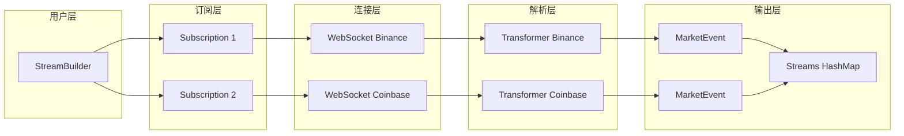

# Barter-Data 架构分析

## 概述

`barter-data` 是一个高性能的 WebSocket 集成库，用于从加密货币交易所流式获取公开市场数据。它通过统一的接口实时提供标准化的交易所数据。

## 核心设计理念

### 标准化数据模型

不同交易所的原始数据格式各异，`barter-data` 将它们转换为统一的 `MarketEvent<T>` 类型：

```rust
pub struct MarketEvent<InstrumentKey, Kind> {
    pub time_exchange: DateTime<Utc>,
    pub time_received: DateTime<Utc>,
    pub instrument: InstrumentKey,
    pub kind: Kind,
}
```

---

## 模块结构

```
barter-data/src/
├── lib.rs              # MarketStream trait, 入口
├── event.rs            # MarketEvent 定义
├── error.rs            # DataError
├── instrument.rs       # 交易工具适配
├── exchange/           # 交易所连接器 (8个)
│   ├── mod.rs          # Connector trait
│   ├── binance/        # Binance (Spot/Futures)
│   ├── bitfinex/
│   ├── bitmex/
│   ├── bybit/
│   ├── coinbase/
│   ├── gateio/
│   ├── kraken/
│   └── okx/
├── subscription/       # 订阅类型
│   ├── mod.rs          # Subscription, SubscriptionKind
│   ├── trade.rs        # PublicTrades
│   └── book/           # OrderBooksL1, L2, L3
├── streams/            # 流构建器
│   ├── mod.rs          # Streams 集合
│   ├── builder/        # StreamBuilder
│   ├── consumer/       # 消费循环
│   └── reconnect/      # 自动重连
├── subscriber/         # 订阅管理
└── transformer/        # 数据转换
```

---

## 核心抽象

### 1. MarketStream Trait

定义市场数据流的标准接口：

```rust
#[async_trait]
pub trait MarketStream<Exchange, Instrument, Kind>: Stream {
    async fn init(
        subscriptions: &[Subscription<Exchange, Instrument, Kind>],
    ) -> Result<Self, DataError>;
}
```

### 2. Connector Trait

每个交易所必须实现的连接器接口：

```rust
pub trait Connector: Send + Sync {
    /// 交易所标识
    const ID: ExchangeId;
    
    /// WebSocket 订阅消息类型
    type SubscribeMessage;
    
    /// 订阅请求构建
    fn requests(subs: &[Subscription]) -> Vec<WsMessage>;
    
    /// 交易工具 ID 映射
    fn expected_responses(subs: &[Subscription]) 
        -> HashMap<SubscriptionId, Sub>;
}
```

### 3. SubscriptionKind

订阅类型枚举：

| 类型 | 说明 | Event 类型 |
|------|------|-----------|
| `PublicTrades` | 公开成交 | `Trade` |
| `OrderBooksL1` | 最优买卖价 | `OrderBookL1` |
| `OrderBooksL2` | 深度行情 | `OrderBook` |
| `OrderBooksL3` | 逐笔挂单 | `OrderBook` |

### 4. StreamBuilder

流构建器 API：

```rust
let streams = Streams::<PublicTrades>::builder()
    .subscribe([
        (BinanceSpot::default(), "btc", "usdt", Spot, PublicTrades),
        (BinanceSpot::default(), "eth", "usdt", Spot, PublicTrades),
    ])
    .subscribe([
        (Coinbase, "btc", "usd", Spot, PublicTrades),
    ])
    .init()
    .await?;
```

**设计原因**：
- 每个 `subscribe()` 创建独立的 WebSocket 连接
- 支持链式调用，一次订阅多个交易对
- 自动处理交易所特定的消息格式

---

## 数据流架构



## 支持的交易所

| 交易所 | 现货 | 永续 | 期货 | 期权 |
|--------|------|------|------|------|
| Binance | ✅ | ✅ | ✅ | ✅ |
| Bybit | ✅ | ✅ | - | - |
| Coinbase | ✅ | - | - | - |
| Gateio | ✅ | ✅ | ✅ | ✅ |
| Kraken | ✅ | - | - | - |
| Okx | ✅ | ✅ | ✅ | ✅ |
| Bitfinex | ✅ | - | - | - |
| Bitmex | - | ✅ | - | - |

---

## 重连机制

```rust
pub struct ReconnectingStream<S> {
    state: StreamState<S>,
    reconnect_policy: ReconnectPolicy,
}

enum StreamState<S> {
    Connected(S),
    Reconnecting { attempts: usize },
    Failed,
}
```

**特性**：
- 指数退避重试
- 自动重新订阅
- 错误事件通知

---

## 为什么这样设计

1. **标准化输出**：不同交易所统一为 `MarketEvent<T>`，策略代码无需关心数据来源
2. **并发安全**：每个交易所独立 WebSocket，互不影响
3. **可扩展**：添加新交易所只需实现 `Connector` trait
4. **自动重连**：网络故障自动恢复，提高系统可靠性
5. **Builder 模式**：类型安全的 DSL 式 API

---

## 依赖关系

```
barter-instrument (交易工具定义)
    ↓
barter-integration (WebSocket 基础设施)
    ↓
barter-data ← 当前模块
    ↓
barter (交易引擎)
```
