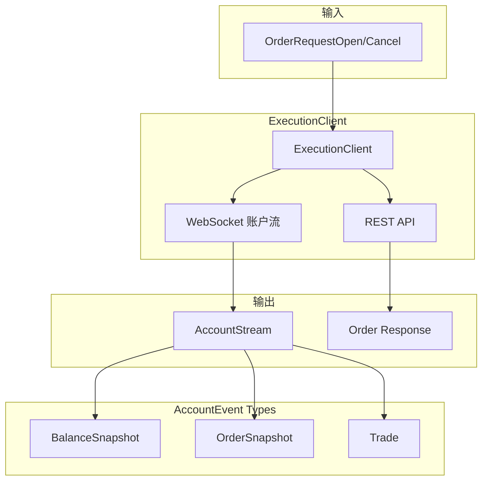

# Barter-Execution 架构分析

## 概述

`barter-execution` 提供从金融交易所流式获取私有账户数据和执行订单的能力。它还包含功能丰富的 `MockExchange` 用于回测和模拟交易。

## 核心设计理念

### 统一执行接口

无论是真实交易所还是模拟交易所，都通过相同的 `ExecutionClient` trait 进行交互：

```rust
// 实盘与回测使用相同的代码
fn execute<C: ExecutionClient>(client: &C, order: OrderRequest) {
    client.open_order(order).await;
}
```

---

## 模块结构

```
barter-execution/src/
├── lib.rs              # AccountEvent, AccountSnapshot
├── error.rs            # 执行错误类型
├── balance.rs          # AssetBalance
├── trade.rs            # Trade 成交记录
├── client/
│   ├── mod.rs          # ExecutionClient trait
│   ├── mock/           # MockExecutionClient
│   └── binance/        # Binance 实现
├── order/
│   ├── mod.rs          # Order 核心结构
│   ├── id.rs           # OrderId 类型
│   ├── state.rs        # OrderState (Pending/Open/Closed)
│   └── request.rs      # OrderRequest 请求类型
├── exchange/
│   └── mock/           # MockExchange 模拟交易所
├── indexer.rs          # 索引器
└── map.rs              # 订单映射表
```

---

## 核心抽象

### 1. ExecutionClient Trait

统一的交易所执行接口：

```rust
pub trait ExecutionClient: Clone {
    const EXCHANGE: ExchangeId;
    type Config: Clone;
    type AccountStream: Stream<Item = UnindexedAccountEvent>;

    // 构造函数
    fn new(config: Self::Config) -> Self;
    
    // 账户快照
    fn account_snapshot(
        &self,
        assets: &[AssetNameExchange],
        instruments: &[InstrumentNameExchange],
    ) -> impl Future<Output = Result<AccountSnapshot, ClientError>>;
    
    // 账户事件流
    fn account_stream(...) -> impl Future<Output = Result<AccountStream, ClientError>>;
    
    // 订单操作
    fn open_order(&self, request: OrderRequestOpen) -> impl Future<Output = Option<Order>>;
    fn cancel_order(&self, request: OrderRequestCancel) -> impl Future<Output = Option<...>>;
    fn open_orders(&self, requests: impl IntoIterator) -> impl Stream<...>;
    fn cancel_orders(&self, requests: impl IntoIterator) -> impl Stream<...>;
    
    // 查询操作
    fn fetch_balances(&self, assets: &[...]) -> impl Future<...>;
    fn fetch_open_orders(&self, instruments: &[...]) -> impl Future<...>;
    fn fetch_trades(&self, time_since: DateTime) -> impl Future<...>;
}
```

### 2. AccountEvent

账户事件流，引擎核心输入之一：

```rust
pub struct AccountEvent<ExchangeKey, AssetKey, InstrumentKey> {
    pub exchange: ExchangeKey,
    pub kind: AccountEventKind<ExchangeKey, AssetKey, InstrumentKey>,
}

pub enum AccountEventKind {
    Snapshot(AccountSnapshot),       // 全量快照
    BalanceSnapshot(AssetBalance),   // 余额更新
    OrderSnapshot(Order),            // 订单状态
    OrderCancelled(ResponseCancel),  // 取消响应
    Trade(Trade),                    // 成交
}
```

### 3. Order 状态机

```rust
pub struct Order<ExchangeKey, InstrumentKey, State> {
    pub exchange: ExchangeKey,
    pub instrument: InstrumentKey,
    pub cid: ClientOrderId,
    pub side: Side,
    pub state: State,
}

// 订单状态
pub enum OrderState {
    Pending(Pending),    // 待提交
    Open(Open),          // 活跃中
    Closed(Closed),      // 已关闭
}

pub struct Open {
    pub id: OrderId,
    pub price: Decimal,
    pub quantity: Decimal,
    pub filled_quantity: Decimal,
    pub time_exchange: DateTime<Utc>,
}
```

**状态转换**：
```
Pending → Open (交易所确认)
Open → Open (部分成交)
Open → Closed (完全成交/取消/拒绝)
```

### 4. MockExchange

模拟交易所，支持回测和模拟交易：

```rust
pub struct MockExchange {
    orders: OrderBook,
    balances: HashMap<AssetKey, Decimal>,
    // 模拟延迟、滑点等
}
```

**功能**：
- 模拟订单簿
- 模拟成交
- 模拟账户余额
- 可配置延迟和滑点

---

## 数据流



---

## 订单请求类型

```rust
// 开仓请求
pub struct OrderRequestOpen<ExchangeKey, InstrumentKey> {
    pub exchange: ExchangeKey,
    pub instrument: InstrumentKey,
    pub cid: ClientOrderId,
    pub side: Side,
    pub price: Decimal,
    pub quantity: Decimal,
    pub time_in_force: TimeInForce,
}

// 取消请求
pub struct OrderRequestCancel<ExchangeKey, InstrumentKey> {
    pub exchange: ExchangeKey,
    pub instrument: InstrumentKey,
    pub order_id: OrderId,
}
```

---

## 为什么这样设计

1. **接口统一**：`ExecutionClient` trait 使实盘与回测代码完全相同
2. **状态机清晰**：`OrderState` 枚举明确订单生命周期
3. **事件驱动**：`AccountStream` 实时推送，无需轮询
4. **泛型灵活**：`Order<ExchangeKey, InstrumentKey, State>` 支持索引化前后
5. **模拟完整**：`MockExchange` 支持完整的回测场景

---

## 依赖关系

```
barter-instrument (资产/工具定义)
    ↓
barter-integration (HTTP/WebSocket)
    ↓
barter-execution ← 当前模块
    ↓
barter (交易引擎)
```
