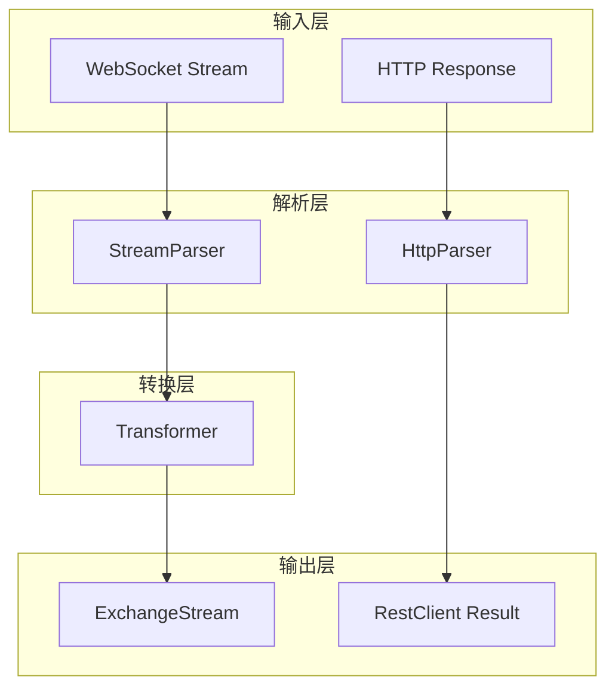

# Barter-Integration 架构分析

## 概述

`barter-integration` 是一个高性能、底层的 Web 集成框架，为 Barter 生态系统提供与交易所通信的基础设施。它是 `barter-data` 和 `barter-execution` 的依赖基础。

## 核心设计理念

### 协议无关的抽象设计

框架设计为协议无关，通过泛型和 Trait 支持：
- **HTTP/REST** - 同步请求/响应
- **WebSocket** - 异步双向流
- **FIX** - 金融信息交换协议
- **Protobuf** - 二进制序列化

---

## 模块结构

```
barter-integration/src/
├── lib.rs              # 核心 Trait: Validator, Transformer, Terminal
├── error.rs            # SocketError 统一错误类型
├── protocol/
│   ├── mod.rs          # StreamParser trait
│   ├── http/           # REST 客户端
│   │   ├── rest/       # RestClient, RestRequest
│   │   ├── private/    # RequestSigner (签名认证)
│   │   └── public/     # 公开 API 无需签名
│   └── websocket.rs    # WebSocket 解析器
├── stream/
│   ├── mod.rs          # ExchangeStream
│   ├── indexed.rs      # 索引化流
│   └── merge.rs        # 流合并工具
├── channel.rs          # Tx trait (通道抽象)
├── collection/         # 集合工具
├── de.rs               # 反序列化工具
├── metric.rs           # 指标类型
├── snapshot.rs         # Snapshot 包装器
└── subscription.rs     # SubscriptionId
```

---

## 核心抽象

### 1. Transformer Trait

将输入数据转换为输出数据的迭代器：

```rust
pub trait Transformer {
    type Error;
    type Input;
    type Output;
    type OutputIter: IntoIterator<Item = Result<Self::Output, Self::Error>>;

    fn transform(&mut self, input: Self::Input) -> Self::OutputIter;
}
```

**设计原因**：
- 一个输入可能产生多个输出（如批量消息）
- 支持有状态转换（如累计成交量）
- 错误处理嵌入输出流

### 2. StreamParser Trait

解析协议消息为业务类型：

```rust
pub trait StreamParser<Output> {
    type Message;   // 协议原始消息
    type Error;     // 协议错误

    fn parse(input: Result<Self::Message, Self::Error>) 
        -> Option<Result<Output, SocketError>>;
}
```

**实现**：
- `WebSocketSerdeParser` - JSON 解析
- `WebSocketProtobufParser` - Protobuf 解析

### 3. ExchangeStream

协议无关的异步流，核心数据处理管道：

```rust
pub struct ExchangeStream<Protocol, InnerStream, StreamTransformer> {
    stream: InnerStream,        // 底层协议流 (WebSocket/FIX)
    transformer: StreamTransformer,  // 数据转换器
    buffer: VecDeque<...>,      // 输出缓冲区
}
```

**数据流**：
```
InnerStream (WebSocket)
    ↓ poll_next()
Protocol::Message
    ↓ StreamParser::parse()
ExchangeMessage
    ↓ Transformer::transform()
OutputIter
    ↓ buffer
最终输出
```

### 4. RestClient 架构

```rust
RestClient<BuildStrategy, Parser> {
    builder: BuildStrategy,  // 请求构建策略
    parser: Parser,          // 响应解析器
    http: reqwest::Client,
}
```

**签名流程**：
```
RestRequest
    ↓ BuildStrategy::build()
        ↓ Signer::config() - 收集签名配置
        ↓ Signer::add_bytes_to_sign() - 构建签名数据
        ↓ HMAC 签名
        ↓ Signer::build_signed_request() - 添加 Headers
reqwest::Request
    ↓ execute()
Response
    ↓ HttpParser::parse()
Result<T, Error>
```

---

## 核心 Traits 关系



---

## 为什么这样设计

1. **协议解耦**：`StreamParser` 将 WebSocket/FIX 等协议与业务逻辑分离
2. **可扩展性**：实现新交易所只需实现 `Transformer`
3. **类型安全**：泛型编译期保证类型正确
4. **零拷贝**：使用 `From`/`Into` 转换避免不必要拷贝
5. **背压处理**：`VecDeque` 缓冲区处理 1:N 消息转换

---

## 依赖关系

```
barter-instrument (基础类型)
    ↓
barter-integration ← 当前模块
    ↓
├── barter-data (市场数据)
└── barter-execution (订单执行)
```
