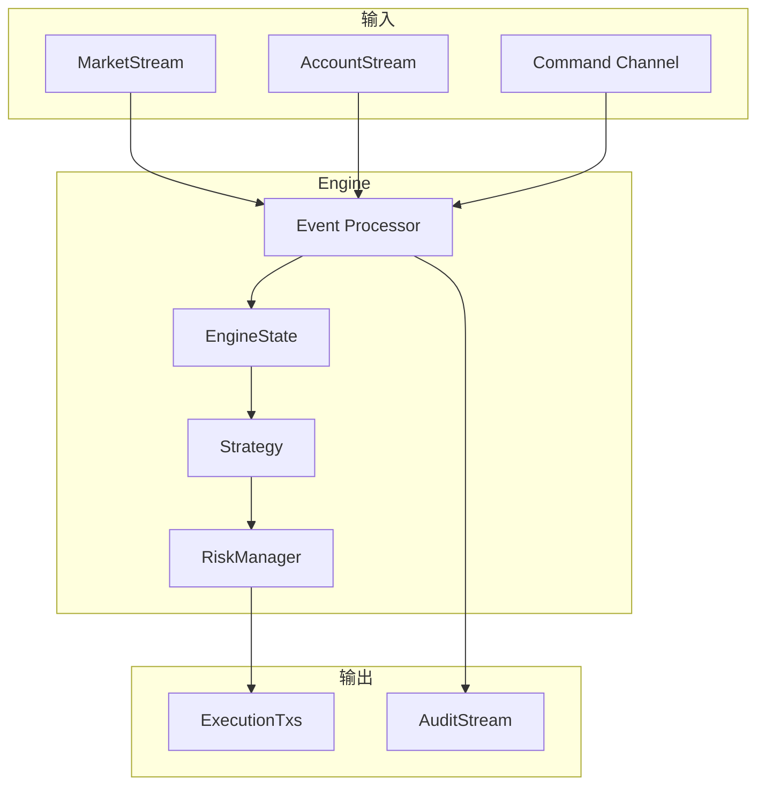

# Barter 核心引擎架构分析

## 概述

`barter` 是 Barter 生态系统的核心模块，提供一个高性能、可扩展的算法交易引擎。它支持实盘交易、模拟交易和回测，通过可插拔的 `Strategy` 和 `RiskManager` 组件适应各类交易策略。

## 核心设计理念

### 事件驱动架构

Engine 是一个事件驱动的状态机，处理三类事件：
1. **MarketEvent** - 市场数据更新
2. **AccountEvent** - 账户/订单状态变化
3. **Command** - 外部控制命令

```rust
pub enum EngineEvent<MarketKind, ExchangeKey, AssetKey, InstrumentKey> {
    Account(AccountEvent<ExchangeKey, AssetKey, InstrumentKey>),
    Command(Command),
    Market(MarketStreamEvent<InstrumentKey, MarketKind>),
}
```

---

## 模块结构

```
barter/src/
├── lib.rs              # EngineEvent, Timed, Sequence
├── engine/
│   ├── mod.rs          # Engine 核心
│   ├── run.rs          # 运行循环 (sync/async)
│   ├── clock.rs        # EngineClock (Live/Historical)
│   ├── command.rs      # Command 外部命令
│   ├── execution_tx.rs # ExecutionTxMap
│   ├── action/         # Command 处理
│   │   ├── cancel_orders.rs
│   │   ├── close_positions.rs
│   │   └── open_orders.rs
│   ├── state/          # EngineState
│   │   ├── mod.rs
│   │   ├── instrument/ # 每个工具的状态
│   │   ├── order/      # 订单管理
│   │   ├── position.rs # 持仓跟踪
│   │   ├── asset/      # 资产余额
│   │   └── connectivity/ # 连接状态
│   └── audit/          # 审计日志
├── strategy/           # 策略接口
│   ├── mod.rs          # DefaultStrategy
│   ├── algo.rs         # AlgoStrategy
│   ├── close_positions.rs
│   ├── on_disconnect.rs
│   └── on_trading_disabled.rs
├── risk/               # 风控管理
│   └── mod.rs          # RiskManager trait
├── statistic/          # 交易统计
│   └── summary/        # TradingSummary
├── system/             # System 构建器
│   ├── mod.rs          # SystemBuilder
│   └── builder.rs
└── execution/          # 执行组件
```

---

## 核心抽象

### 1. Engine

算法交易引擎的核心结构：

```rust
pub struct Engine<Clock, State, ExecutionTxs, Strategy, Risk> {
    pub meta: EngineMeta,           // 元数据 (序列号、时间等)
    pub clock: Clock,                // 时钟 (Live/Historical)
    pub state: State,                // EngineState
    pub execution_txs: ExecutionTxs, // 执行通道
    pub strategy: Strategy,          // 交易策略
    pub risk: Risk,                  // 风控管理器
}
```

**处理流程**：
```
Event → Engine.process() 
      → State 更新 
      → Strategy.generate_algo_orders() 
      → RiskManager.check_orders() 
      → 发送订单
      → 返回 Audit
```

### 2. EngineState

集中式状态管理，O(1) 索引查找：

```rust
pub struct EngineState<GlobalData, InstrumentData> {
    pub time: DateTime<Utc>,
    pub trading: TradingState,       // Enabled/Disabled
    pub connectivity: ConnectivityState,
    pub global: GlobalData,          // 全局数据
    pub instruments: InstrumentStates<InstrumentData>,
}

pub struct InstrumentState<Data> {
    pub data: Data,                  // 市场数据
    pub orders: OrderManager,        // 订单管理
    pub position: Position,          // 持仓
}
```

### 3. Strategy Traits

模块化策略接口：

| Trait | 用途 |
|-------|------|
| `AlgoStrategy` | 生成算法订单 |
| `ClosePositionsStrategy` | 平仓逻辑 |
| `OnDisconnectStrategy` | 断连处理 |
| `OnTradingDisabled` | 停止交易时处理 |

```rust
pub trait AlgoStrategy<ExchangeKey, InstrumentKey> {
    type State;
    
    fn generate_algo_orders(
        &self,
        state: &Self::State,
    ) -> (
        impl IntoIterator<Item = OrderRequestCancel>,
        impl IntoIterator<Item = OrderRequestOpen>,
    );
}
```

### 4. RiskManager Trait

订单风控检查：

```rust
pub trait RiskManager {
    type State;
    
    fn check_orders(
        &self,
        state: &Self::State,
        requests: Vec<OrderRequestOpen>,
    ) -> Vec<OrderRequestOpen>;
}
```

### 5. Command

外部控制命令：

```rust
pub enum Command {
    UpdateTradingState(TradingState),
    CancelOrders(InstrumentFilter),
    ClosePositions(InstrumentFilter),
}
```

---

## 数据流架构



## 运行模式

| 模式 | 函数 | 输入类型 |
|------|------|----------|
| 同步迭代器 | `sync_run()` | `impl Iterator` |
| 同步+审计 | `sync_run_with_audit()` | `impl Iterator` |
| 异步流 | `async_run()` | `impl Stream` |
| 异步+审计 | `async_run_with_audit()` | `impl Stream` |

---

## 时钟系统

```rust
pub trait EngineClock {
    fn time(&self) -> DateTime<Utc>;
}

pub struct LiveClock;  // 实时时钟
pub struct HistoricalClock { time: DateTime<Utc> }  // 回测时钟
```

---

## SystemBuilder

便捷的系统构建器 API：

```rust
let system = SystemBuilder::new(args)
    .engine_feed_mode(EngineFeedMode::Iterator)
    .audit_mode(AuditMode::Enabled)
    .trading_state(TradingState::Disabled)
    .build::<EngineEvent, GlobalData, InstrumentData>()?
    .init_with_runtime(runtime.handle())
    .await?;
```

---

## 为什么这样设计

1. **事件驱动**：统一处理模型，支持实盘和回测
2. **泛型组合**：`Engine<Clock, State, ExecTxs, Strategy, Risk>` 灵活组合
3. **O(1) 状态查找**：索引化数据结构，热路径高效
4. **可插拔策略**：Trait 分离，便于测试和替换
5. **审计追踪**：完整的事件日志，支持复盘

---

## 依赖关系

```
barter-instrument
    ↓
barter-integration
    ↓
├── barter-data (市场数据)
└── barter-execution (订单执行)
    ↓
barter ← 核心引擎 (当前模块)
```
